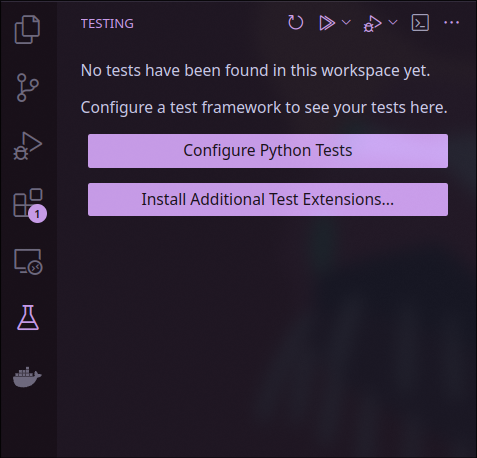
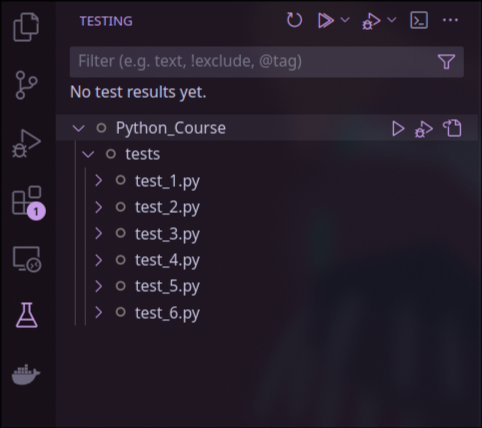
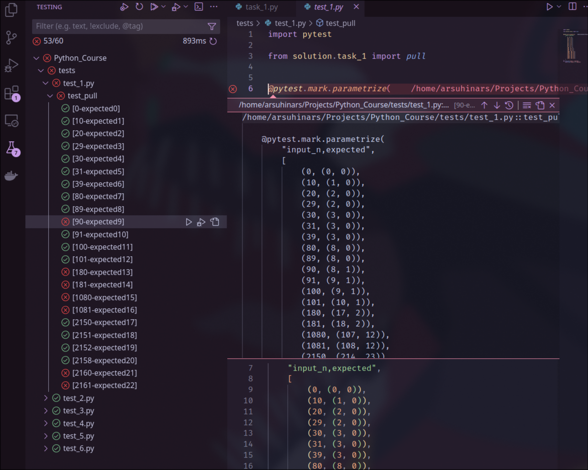

# pytest

> Pytest — это популярная библиотека для тестирования кода на Python, 
> которая поддерживает как простые, так и сложные тесты. Она 
> используется для автоматизации тестов, облегчая процесс написания, 
> запуска и отчета о тестах, поддерживая параметризацию и плагины для 
> расширения функционала.

## Установка pytest
Введите следующую команду в терминале:
```shell
$ pip install -U pytest
```

Проверка правильности установки:
```shell
$ python -m pytest --version
pytest 8.3.3
```

## Написание своих тестов
`pytest` запускает все файлы в названиями вида `test_*.py` или `*_test.py` в текущей директории или поддиректориях.

`pytest` запускает все функции, которые начинаются с `test_`. Для проверки ожидаемых результатов используется ключевое слово `assert`.

`assert` — это оператор, который проверяет истинность выражения. Если выражение оказывается ложным, `assert` вызывает исключение `AssertionError`, прерывая выполнение программы. Если тест выбрасывает это исключение, то `pytest` считает его проваленным и выведет отчет об ошибке.

## Пример теста
```python
# my_module.py
def add(a, b):
    return a + b
```

```python
# test_my_module.py
from my_module import add


def test_add_positive_numbers():
    assert add(8, 4) == 12


def test_add_negative_numbers():
    assert add(-3, -7) == -10
```

## Запуск тестов
Команда для запуска тестов в текущей директории:
```shell
$ python -m pytest .
========================= test session starts =========================
platform linux -- Python 3.12.6, pytest-8.3.3, pluggy-1.5.0
rootdir: /home/arsuhinars/Projects/python_test
plugins: typeguard-4.3.0
collected 2 items                                                     

test_my_module.py ..                                            [100%]

========================== 2 passed in 0.00s ==========================
```

Для удобства можно воспользоваться встроенным терминалом в VS Code, который открывается через сочетание Ctrl+\`. Терминал откроется сразу в директории текущего проекта.

## Параметризованные тесты
Параметризованные тесты — это способ запускать один и тот же тест с различными входными данными. Это позволяет проверять функцию на множестве случаев без дублирования кода. Параметризация полезна, когда одно и то же поведение функции нужно протестировать с разными наборами данных.

В `pytest` для создания параметризованных тестов используется декоратор `@pytest.mark.parametrize`.

Декоратор `@pytest.mark.parametrize` принимает два основных аргумента:
- **Переменные**: Имена параметров, которые будут использоваться в тестовой функции.
- **Набор значений**: список, содержащий кортежи, которые будут переданы в тестовую функцию. Каждый кортеж должен соответствовать количеству и порядку переменных, указанных в первом аргументе.

Пример:
```python
# test_my_module.py
import pytest

from my_module import add


@pytest.mark.parametrize(
    "x,y,expected",
    [
        (5, 7, 12),
        (8, 2, 10),
        (-4, 7, 3),
        (-5, -4, -9),
        (-9, 3, -6)
    ]
)
def test_add_numbers(x, y, expected):
    assert add(x, y) == expected
```

## Запуск тестов из VS Code
В VS Code есть специальная вкладка для тестирования, которая позволяет удобно запускать и управлять тестами, включая тесты для `pytest`.

Перейти в нее возможно из левой панели:



Первоначально необходимо сконфигурировать запуск тестов. Для этого необходимо нажать `Configure Python Tests` и выбрать `pytest` в открывшемся диалоговом окне, далее выбрать текущую директорию (`. Root directory`). После этого тесты можно будет выборочно запускать прямо из интерфейса среды.



После запуска тестов можно будет посмотреть отчет:


