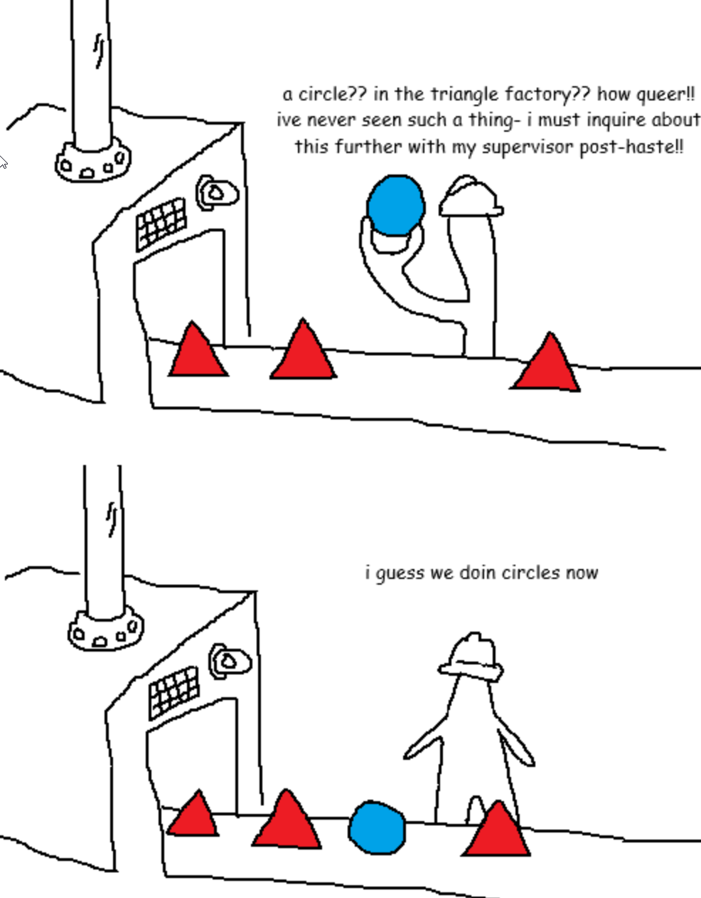

# 4. Конвейер


Имеется $n$ станков, время обработки одной детали на $i$-том станке занимает $t_i$ секунд.

Всего имеется $m$ деталей. $j$-тая деталь поступает на завод в $q_j$ момент времени.

Каждая деталь должна пройти все $n$ станков от 1 до $n$ последовательно. Обработка на следующем станке начинается после того, как закончится обработка на предыдущем.

Станок может обрабатывать только одну деталь одновременно. Если станок свободен, то деталь попадает на обработку, иначе она встает в очередь. 

Необходимо рассчитать момент времени $c_j$, в который деталь будет полностью обработана.

## Формат решения
```python
def pipeline(stages: list[int], details: list[int]) -> list[int]:
	"""
		Аргументы:
		stages - список длиной n с длительностью обработки детали на каждом станке.
		details - список длиной m с временем поступления каждой детали.

		Возвращает список длиной m, в котором хранится момент времени полной обработки каждой детали. 
	"""
	pass
```

## Примеры
1. **Входные данные**:  
	   stages: `[1, 2, 3]`  
	   details: `[0, 6, 2]`  
   **Ответ**: `[6, 12, 9]`
2. **Входные данные**:  
	   stages: `[5, 5, 2]`  
	   details: `[6, 0, 7]`  
   **Ответ**: `[18, 12, 23]`
3. **Входные данные**:  
	   stages: `[5, 1, 10, 4]`  
	   details: `[3, 0, 4, 20]`  
   **Ответ**: `[30, 20, 40, 50]`
